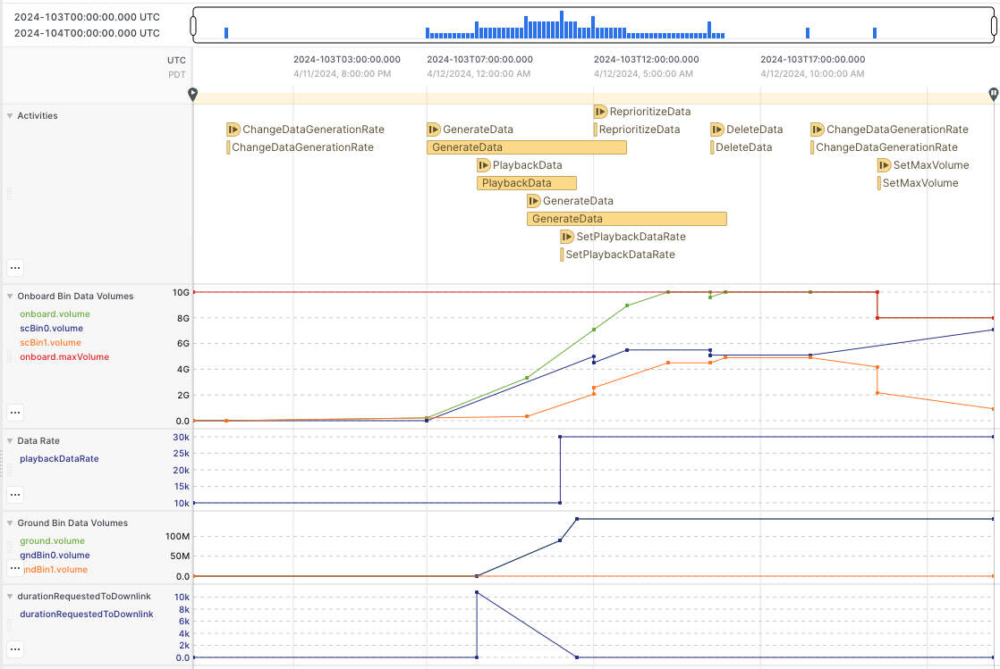

# Data Model Behavior Description

The data model has a specified number of data bins (`Bucket` objects).  They are prioritized for when the storage
max capacity is reached and for playback/downlink.  There are "ground" bins associated with "onboard" spacecraft bins.
The ground bins track the data that has been played back for each bin.

A number of activities are used to specify the inflow of data to the bins, the playback of that data to ground, the
deletion of data, and moving data from one bin to another.

## Data Model Activities

### ChangeDataGenerationRate(bin, rate)
This activity specifies a never-ending flow of data into an onboard bin at a specified rate.

### GenerateData(bin, rate, volume, duration)
Use this activity for a temporary flow of data into an onboard bin.  Only two of `rate`, `volume`, and `duration` need
to be specified since the third can be computed from two.  If three are specified, it treats the values as max values
and one will be restricted to meet the other two.

### PlaybackData(volume, duration)
This activity plays back data from the spacecraft to ground based using the datarate resource to specify the changing
datarate.  Either a volume goal or a duration goal can be specified.  Do not specify both.  Data is sent to ground for
the bin with the highest priority that has data that has not yet been played back.  This bin can change many times
during the activity.

### DeleteData(bin, volume, limitToSentData)
This deletes data from the specified bin immediately.  The amount actually deleted is a minimum of the specified volume,
the volume of data in the bin, and, if `limitToSentData` is `true`, the amount of data in the bin that has already
been played back.

### ReprioritizeData(bin, newBin, volume)
Re-prioritize data by moving the specified `volume` from `bin` to `newBin` immediately.

## Demo Model Activities

This repository is divided into a `model` module, which is meant to be re-used in different mission models, and a `demo`
module, which demonstrates how a mission model can use the data model package.  The `demo` module has two of its own
activities for changing the playback datarate and the maximum volume of the spacecraft.  These two resources are passed into the
[Data](../model/src/main/java/gov/nasa/jpl/aerie_data/Data.java) class interface since they may be defined differently
for different missions.

### SetDataRate(rate)
Changes the playback datarate to the specified rate immediately.

### SetMaxVolume(volume)
Changes the max storage volume to the specified volume immediately.

## Bucket Behavior
The representation of data volumes is captured by a `Bucket` class.  This class is meant to be a generic container of
amounts, not necessarily specific to data.  It is structured such that a parent bucket could have child buckets which
are prioritized.  If the parent maximum volume is reached, and the child buckets are still receiving data, the highest
priority bucket would continue to receive data, and data will be simultaneously deleted from the lowest priority bucket
to give room for the higher priority data.  This priority is also used to determine which data is played back during
a `PlaybackData` activity.

Each bucket has its own maximum volume that may be specified directly by the user or computed based on its parent's max
volume and current volume (which is the sum of its children's volumes. The max volume of both the parent and child can
change over time.  If the parent bucket max volume is reached, higher priority buckets will continue to receive data at
the desired rate as long as there is data to overwrite/delete from lower priority buckets to compensate.
The actual data rates are computed from the desired data rates with the following relationship:

$\text{If } \sum_{j \in C(P(i))} v_j < u_{P(i)}, \text{ then } u_i := u_{P(i)}. \text{ Otherwise, }$

$\text{Let } C_i := \forall {j \in C(P(i)), j > i}\ :\ v_j \leq 0 \text{ be true when this is the bucket to steal from. }$

$\text{Let } E := u_{P(i)}' - \sum_{j \in C(P(i))} \min\left( d_j, 0 \right) \text{ be the available write rate.}$

$\text{Let } F := \sum_{j \in C(P(i)),\ j < i} \max\left( d_j, 0 \right) \text{ be the write rate used by higher-priority buckets.}$

$\text{If } C, u_i := \max\left(0, v_i + \int \min\left( d_i, E - F \right) \right) \text{ to let higher-priority buckets steal from us.}$

$\text{Otherwise, } u_i := u_{P(i)} \text{ because we can steal if needed.}$

where: \
$C$ is the child bucket \
$P$ is the parent bucket, where $P(i)$ is the parent of child $i$ and $C(P(i))$ is the set of children of the parent of child $i$ \
$d$ is the desired rate \
$v$ is the actual rate \
$u$ is the upper bound \
$u'$ is the rate of change of the upper bound

## Example Plan

The screenshot below demonstrates the behavior of the activities and buckets/bins as described above in a [sample plan](../sample-plan.json).

A `ChangeDataGenerationRate` activity adds a slow rate into `scBin1`.  `GenerateData` activities add 6Gb
to `scBin0` and 5Gb to `scBin1` over 6 hours.  These accumulate to hit the 10Gb max volume limit.
A `PlaybackData` activity adds data to `gndBin0` over 3 hours, during which a `SetDataRate` activity triples
the playback datarate.  A `ReprioritizeData` activity recategorizes 0.5 Gb
from `scBin0` to `scBin1`.  Another `ChangeDataGenerationRate` activity adds a continuing flow into `scBin1`
causing data from `scBin1` to be deleted to make room for the higher priority bin0 data.  Lastly, a `SetMaxVolume`
activity reduces the storage capacity by 2 Gb, and since the storage was full at 10 Gb, it immediately deletes
2 Gb of lower priority data in `scBin1`.

